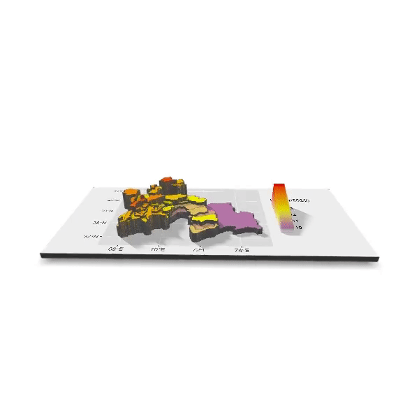

# Tajikistan

This is my final project on Tajikistan

## Administrative Subdivisions of Tajikistan

## Population of Tajikistan's Counties

## Population of Tajikistan's Districts 

## Vanj district of Tajikistan

## Health Infrastructure of Tajikistan

## Questions
1. Tajikistan is a country that is defined by its himalayan peaks that reach a highest point of 25,000. The most mountanous regions of Tajikistan are represented by the lowly populated areas in the east. To the west of the country, we see the majority of Tajikistan's economy and infrastructure. The fragmentation of political subdivisions in this part of the country marks the majority of its activity. The political subdivision that I decided to display is called Vanj. This subdivision is expanded in the "Administrative Subdivisions of Tajikistan" visual. It is also highlighted in the map above by a thick white border.

2. The population of Tajikistan is mostly rural with some urban populations. The capital, Tajikistan, is marked by the cluster of hospitals in the center-west of the country. It can also be seen in the first representation with its red border. The population of this city is roughly one million in size and it shows in the "Population of Tajikistan's Districts" visual. The other subdivision that I chose is Vanj. This subdivision has roughly 40,000 people in total, and thus, it represents the rural, mountaineous regions of Tajikistan. Most of its population follows the Vanj river as its economy is mostly agricultural. 

3. In the last two visuals, we can clearly how geography greatly affects the infrastructure of Tajikistan. The roads are limited to small passes in the mountanous regions of the east. The road network fails to access populations in the middle of the country such as the northern edges of Vanj. It also fails in regions where healcare is extremely limited. The drive on google maps from the hospital in Vanj to the next nearest hospital is roughly two hours. In some cases, there is a gap of 4 hours between hospitals by road. This isn't too bad if the population lives all along the roads, but that does not seem to be the case in the southwest region of the country where there is a major gap in highway access. Overall, Tajikistan is a developing country, and it still has a long way to go in terms of access to infrastructure. The problems preventing development are that building through the mountainous is incredibly costly, and Tajikistan does not have enough GDP to support the necessary projects connecting the country's economy. Given the gap in infrastructure, it would be interesting to do further research on how China's belt and road project has affected Tajikistan. 
